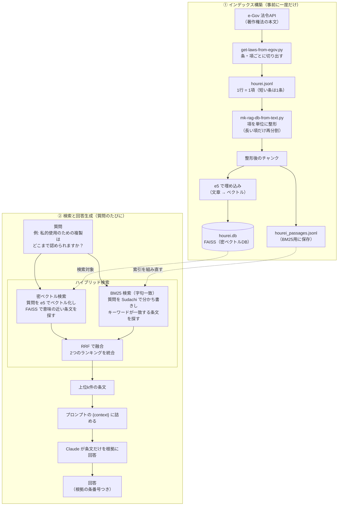

# hourei のフロー

著作権法を題材にした、ハイブリッド検索 RAG の全体像。

RAG は大きく二つの段階に分かれる。
一つは、質問に答える前に一度だけ行う**インデックス構築**（事前準備）。
もう一つは、質問が来るたびに行う**検索と回答生成**。
この二つを分けて眺めるのが、RAG を理解する近道になる。

## 全体像

## 各ステップの読みどころ

### ① インデックス構築

`get-laws-from-egov.py` は、e-Gov 法令API v2 から著作権法の本文を取得する。
本文は入れ子のツリーで返り、条は項（Paragraph）、項は号（Item）に分かれている。
この構造をたどり、短い条は条まるごと、長い条は項ごとに1レコードとして切り出す。
号は属する項の中に残すので、意味の単位が文の途中で割れない。
各レコードの先頭には「法令名 条番号 見出し（＋項番号）」の見出し行を付け、項の途中を切り出したチャンクでも単独で条と主題が読み取れるようにする。

`mk-rag-db-from-text.py` は、その条文を検索しやすい単位に整える。
取得段階ですでに条・項の単位に整えてあるため、通常はそのまま1チャンクにする。
まれに残る極端に長い項だけ、句点区切りで大きめに再分割する保険をかける。
整えたチャンクを二通りに保存するのがハイブリッド検索の準備になる。

- **密ベクトル側**：e5 で各チャンクをベクトルに変換し、FAISS（`hourei.db`）に保存する。意味の近さで探すための索引。
- **疎（BM25）側**：分割済みチャンクを `hourei_passages.jsonl` にそのまま保存する。BM25 索引は軽いので永続化せず、検索時に組み立て直す。

密と疎で同じチャンクの母集団を使うため、両方をここで一度に用意している。

### ② 検索と回答生成

`ask-rag.py` が、質問を受け取ってから回答するまでを担う。
検索では、同じ質問を二つの方法で並行して投げる。

- **密ベクトル検索**：質問を e5 でベクトル化し、FAISS で意味の近い条文を探す。言い回しが違っても内容が近ければ拾える。
- **BM25 検索**：質問を Sudachi で分かち書きし、キーワードが字句として一致する条文を探す。「私的使用のための複製」のような法律用語の完全一致に強い。

二つの検索はそれぞれ別のランキングを返す。
それを **RRF**（Reciprocal Rank Fusion）で一つのランキングに統合し、上位k件の条文を選ぶ。
密ベクトル単独では取りこぼす条文を BM25 が拾い上げるのが、ハイブリッド検索の狙いである。

最後に、選んだ条文をプロンプトの `{context}` に詰めて Claude に渡す。
Claude は「提示された条文だけを根拠に、条番号を示して答える」よう指示されており、根拠のない推測を避ける。

なお `search-rag-db.py` は回答を生成せず、密のみ / BM25のみ / ハイブリッドの3通りの検索結果を並べて比較するためのスクリプトである。
ハイブリッドが何を拾い、単独の手法が何を取りこぼすかを、目で見て確かめられる。
